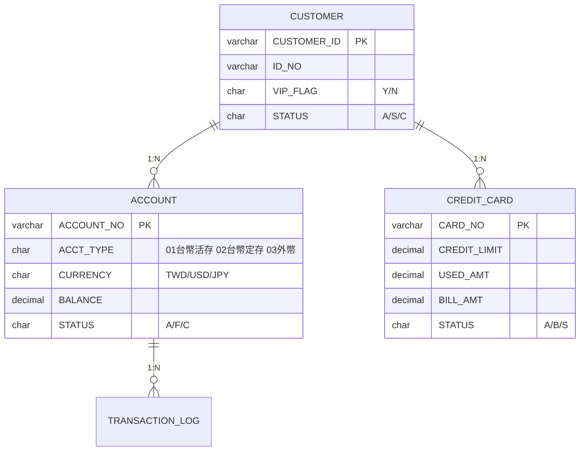
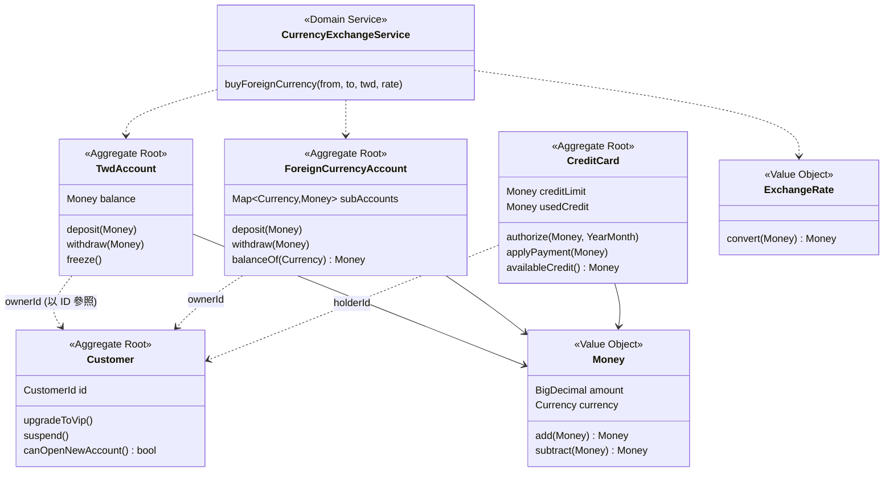
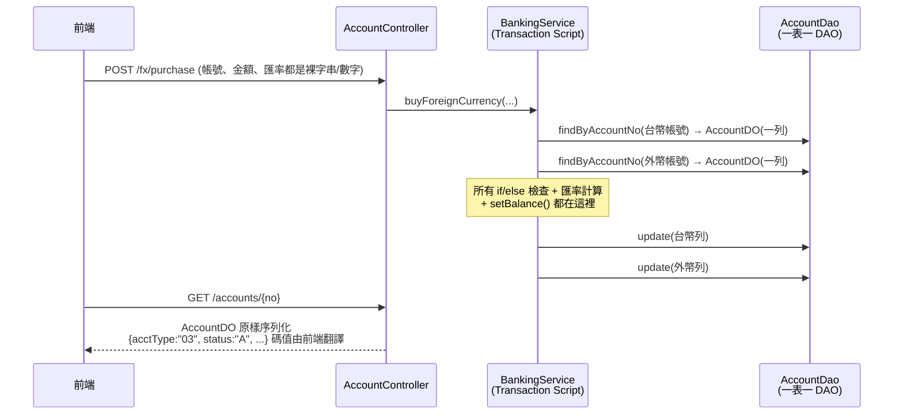
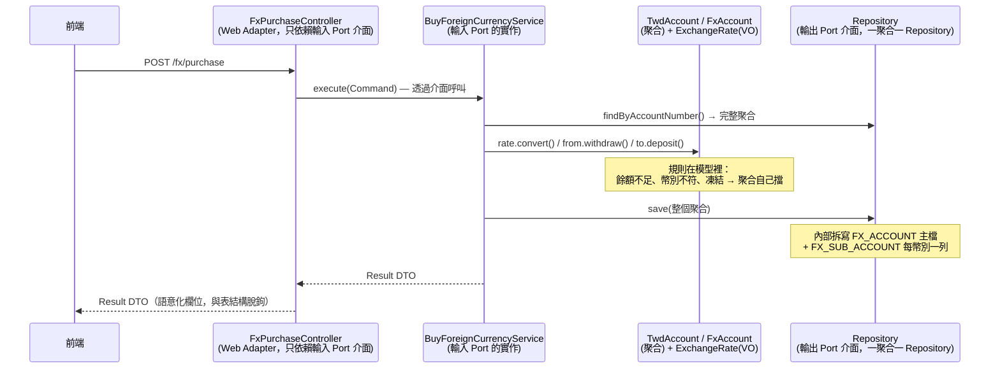
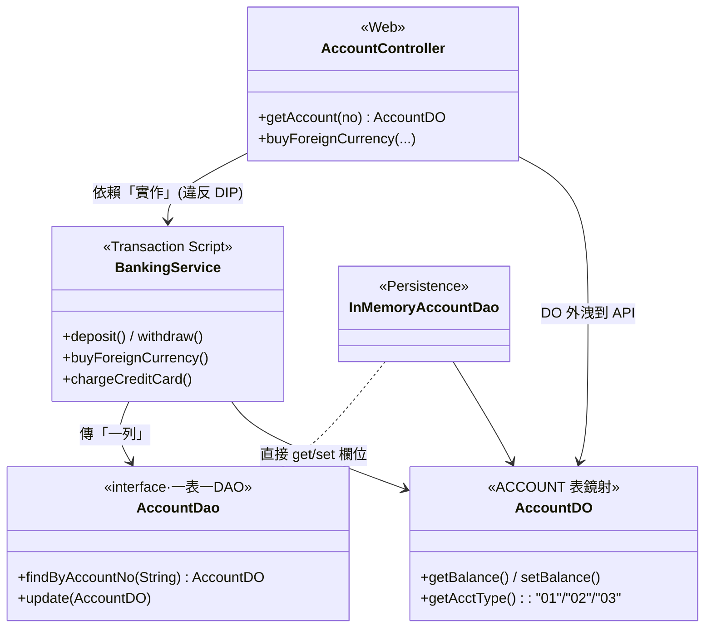

# Data Model vs. Domain Model — 以銀行客戶服務為例

以同一組銀行業務（**台幣帳戶、外幣帳戶、信用卡**）為標的，
用兩套**可執行、可測試**的 Java 程式碼，比較「資料導向（Data Model）」與「領域導向（Domain Model）」
兩種建模方式在 **程式架構** 與 **資料設計** 上的差異。

兩個模組共用**同一份中文 Gherkin 業務場景**（BDD），各自用 Cucumber 驗收自己的實作
——測試本身也是比較的一部分。

```
├── pom.xml                       # Maven 多模組（Cucumber + JUnit 5）
├── data-model-approach/          # 資料導向：資料表鏡射 + Transaction Script
│   ├── schema.sql                #   設計起點：ER 圖與資料表
│   └── src
│       ├── main/.../datamodel/
│       │   ├── web/              #   AccountController —— DO 直接回傳前端
│       │   ├── service/          #   BankingService（Transaction Script，規則全在這）
│       │   ├── dao/              #   一個 DAO 對應一張表，傳輸單位是「一列」
│       │   ├── entity/           #   貧血 DO（只有 getter/setter）
│       │   └── demo/             #   DataModelDemo —— 可執行的端到端驗證
│       └── test/
│           ├── resources/features/   # 中文 Gherkin（與另一模組同一份）
│           └── java/.../bdd/         # Cucumber Step Definitions
└── domain-model-approach/        # 領域導向：聚合 + Value Object + Domain Service
    └── src
        ├── main/.../domainmodel/
        │   ├── web/              #   FxPurchaseController —— 只依賴輸入 Port「介面」
        │   ├── application/
        │   │   ├── port/in/      #   BuyForeignCurrencyUseCase 輸入 Port（介面）
        │   │   └── ...           #   BuyForeignCurrencyService（Port 實作，只編排）
        │   ├── shared/           #   Money / ExchangeRate（Value Object）
        │   ├── customer/ account/ card/  # 聚合：規則的家
        │   ├── service/          #   跨聚合的 Domain Service
        │   ├── repository/       #   一個 Repository 對應「一個聚合」（介面）
        │   ├── infrastructure/   #   Repository 實作：一個聚合 ↔ 多張表
        │   └── demo/             #   DomainModelDemo —— 可執行的端到端驗證
        └── test/                 #   同一份 Gherkin + 自己的 Step Definitions
```

```bash
mvn test                                                            # 跑兩個模組的 Cucumber 驗收（8+8 場景）
java -cp data-model-approach/target/classes  com.bank.datamodel.demo.DataModelDemo
java -cp domain-model-approach/target/classes com.bank.domainmodel.demo.DomainModelDemo
```

---

## 一、兩種模型的出發點

| | Data Model（資料模型） | Domain Model（領域模型） |
|---|---|---|
| 回答的問題 | 資料**長什麼樣、怎麼存**？ | 業務**是什麼、怎麼運作**？ |
| 設計起點 | ER 圖、資料表、欄位、正規化 | 業務概念、規則、通用語言（Ubiquitous Language） |
| 物件的角色 | 資料表的鏡射（DO/PO），只有 getter/setter | 業務概念的化身，有行為、守規則 |
| 業務邏輯位置 | 集中在 Service（Transaction Script） | 分佈在聚合、Value Object、Domain Service |
| 一句話 | **表驅動程式** | **業務驅動程式** |

出發點不同，但**設計結果會體現在每一層**。第三節以同一個使用情境把兩邊的三層全部攤開對照。

---

## 二、資料設計比較

### Data Model：一張 ACCOUNT 表打天下



特徵（見 [`data-model-approach/schema.sql`](data-model-approach/schema.sql)）：

- 台幣與外幣帳戶**共用一張表**，靠 `ACCT_TYPE` + `CURRENCY` 欄位碼區分。
- 客戶「一戶多幣」的外幣綜合帳戶，只能拆成多列資料，概念在 schema 上消失。
- 金額（`BALANCE`）與幣別（`CURRENCY`）是兩個**互不相干的欄位**，資料庫不會阻止你把美元加進台幣餘額。
- 「可用額度 = CREDIT_LIMIT − USED_AMT」是隱含知識，表上看不出來。
- 業務規則（定存不能直接提領、外幣帳戶不收台幣）**完全不在資料層**，全靠應用程式自律。

### Domain Model：概念各自成型，資料是實作細節



特徵：

- 台幣帳戶、外幣帳戶、信用卡是**三個獨立的聚合（型別）**，不是同一張表的三種碼值。
- `Money` 把金額與幣別鎖在一起：`TWD 100 + USD 100` 直接拋 `CurrencyMismatchException`。
- 外幣帳戶「一戶多幣」是模型的第一級概念（`Map<Currency, Money>` 子帳）。
- 「可用額度」是**行為**（`availableCredit()`），定義只寫一次。
- 聚合之間只以 ID 相連（`CustomerId`），維持各自的交易邊界。
- 資料怎麼存由基礎設施層的 Repository 實作決定，領域層不知情——**依賴方向反轉**。

---

## 三、同一個使用情境，走完三層：前端 → Business → Repository

使用情境：**客戶用台幣帳戶 32,500 元，以匯率 32.5 結購美元 1,000 元存入外幣帳戶。**

### Data Model 途徑的三層



### Domain Model 途徑的三層



### Class Diagram：相依方向是兩張圖的分水嶺

**Data Model 途徑（對照組）**——箭頭一路向下穿透，最終全部依賴資料表形狀；
前端依賴 Service「實作」，`AccountDO`（＝ACCOUNT 表的鏡射）還外洩到 API 契約：



**Domain Model 途徑（嚴格 SOLID）**——前端 Adapter 與 Repository 實作**都指向核心**：
Web 依賴輸入 Port「介面」，Infrastructure 實作輸出 Port「介面」；
核心（application + domain）不 import 任何 Adapter，兩端可獨立抽換：


實際 import 驗證（程式碼與圖一致）：

- [`FxPurchaseController`](domain-model-approach/src/main/java/com/bank/domainmodel/web/FxPurchaseController.java) 只 import `application.port.in.BuyForeignCurrencyUseCase`——不認識 Service 實作、聚合、Repository。
- [`InMemoryForeignCurrencyAccountRepository`](domain-model-approach/src/main/java/com/bank/domainmodel/infrastructure/persistence/InMemoryForeignCurrencyAccountRepository.java) 只 import 領域層（Repository 介面＋聚合）——不認識 application 與 web。
- 介面與實作只在**組裝根**（[`DomainModelDemo`](domain-model-approach/src/main/java/com/bank/domainmodel/demo/DomainModelDemo.java) 的 main、或 Spring 的 DI 容器）相遇。

### SOLID 逐條對應

| 原則 | 落在哪裡 | Data Model 途徑的對照 |
|---|---|---|
| **S**RP | Controller 只轉譯、Service 只編排、聚合只守自己的規則、Repository 實作只管存取 | `BankingService` 同時做檢查＋計算＋跨表寫入，三種業務混在一個類別 |
| **O**CP | 加「數位帳戶」＝新增聚合＋新 Repository，既有類別不改 | 加 `ACCT_TYPE=04` 要回頭改每個 if/else |
| **L**SP | 任何 `TwdAccountRepository` 實作（in-memory/JPA/JDBC）可互換，UseCase 行為不變——BDD 測試就是替換證明 | DAO 可替換，但規則在 Service，換儲存仍綁死表結構 |
| **I**SP | 一個 Use Case 一個輸入 Port；一個聚合一個輸出 Port，沒有萬用大介面 | `BankingService` 是萬用入口，呼叫端被迫依賴用不到的方法 |
| **D**IP | **前端依賴輸入 Port 介面；Repository 實作依賴輸出 Port 介面**——高低階模組都依賴抽象，箭頭全部指向核心 | Controller 依賴 Service 實作、全體依賴 `AccountDO`＝依賴資料表 |

### 逐層對照（每一格都有對應的程式檔可驗證）

| 層 | Data Model 途徑 | Domain Model 途徑 |
|---|---|---|
| **前端呈現** | [`AccountController`](data-model-approach/src/main/java/com/bank/datamodel/web/AccountController.java) 依賴 Service **實作**，把 `AccountDO` 原樣回傳：畫面拿到 `acctType:"03"`、`status:"A"`，自己查碼表翻譯。**API 契約 = 資料表 schema**，改表即改 API | [`FxPurchaseController`](domain-model-approach/src/main/java/com/bank/domainmodel/web/FxPurchaseController.java) 只依賴[輸入 Port 介面](domain-model-approach/src/main/java/com/bank/domainmodel/application/port/in/BuyForeignCurrencyUseCase.java)，回傳語意化 DTO（`purchasedFxAmount: "USD 1000.00"`）。聚合不外洩，**API 契約與儲存結構脫鉤** |
| **Business Layer** | `BankingService` 一支 Transaction Script 做完載入、檢查、計算、寫回；規則跨方法重複 | [`BuyForeignCurrencyService`](domain-model-approach/src/main/java/com/bank/domainmodel/application/BuyForeignCurrencyService.java) 實作輸入 Port、只編排（載入→呼叫領域行為→存回→轉 DTO）；規則在聚合與 `ExchangeRate` 裡，各寫一次 |
| **Repository Layer** | **一個 DAO ↔ 一張表**，傳輸單位是「一列 DO」；跨表一致性由 Service 呼叫兩次 `update()` 自行維持 | **一個 Repository ↔ 一個聚合**，`save()` 傳入**整個聚合**；[`InMemoryForeignCurrencyAccountRepository`](domain-model-approach/src/main/java/com/bank/domainmodel/infrastructure/persistence/InMemoryForeignCurrencyAccountRepository.java) 內部拆寫 `FX_ACCOUNT` + `FX_SUB_ACCOUNT` 兩張表，呼叫端毫不知情 |

> **Repository 粒度是兩者最本質的差異之一**：
> Data Model 的 DAO 與資料表一一對應（`AccountDao ↔ ACCOUNT`），聚合這個概念不存在；
> Domain Model 的 Repository 與**聚合**一一對應，聚合對應幾張表是基礎設施的私事——
> `TwdAccount` 剛好一張表、`ForeignCurrencyAccount` 是主檔+子帳兩張表，
> 但兩個 Repository 的契約長得一模一樣：`save(聚合)` / `findBy...() → 聚合`。
> 交易與一致性邊界因此從「Service 方法」移到「聚合」身上。

兩邊各附一支可執行 Demo 驗證上述行為（含 Data Model 途徑「繞過 Service 寫出負餘額、幣別錯帳」的資料洞示範）：
[`DataModelDemo`](data-model-approach/src/main/java/com/bank/datamodel/demo/DataModelDemo.java)、
[`DomainModelDemo`](domain-model-approach/src/main/java/com/bank/domainmodel/demo/DomainModelDemo.java)。

---

## 四、從測試出發：Gherkin → Cucumber → prod. code

BDD 的走法：先用業務語言寫**測試案例**（Gherkin），再寫**測試程式**（Cucumber Step Definitions），
最後讓 **prod. code** 通過驗收。本專案的關鍵設計：**兩個模組共用同一份 Gherkin**——
業務場景與實作方式無關，但 Step Definitions 的長相立刻暴露兩種架構的差異。

### 測試案例（節錄，[完整 feature 檔](domain-model-approach/src/test/resources/features/)）

```gherkin
# language: zh-TW
功能: 台幣結購外幣（換匯）

  場景: 餘額足夠時結購成功
    假設 客戶 "C000001" 的台幣帳戶 "0011223344556" 餘額為 100000 元
    並且 客戶 "C000001" 擁有外幣帳戶 "0099887766554"
    當 以匯率 32.5 用台幣 32500 元結購美元
    那麼 交易成功
    並且 台幣帳戶餘額應為 67500 元
    並且 外幣帳戶的美元子帳餘額應為 1000 美元

  場景: 台幣餘額不足時拒絕交易
    假設 客戶 "C000001" 的台幣帳戶 "0011223344556" 餘額為 10000 元
    並且 客戶 "C000001" 擁有外幣帳戶 "0099887766554"
    當 以匯率 32.5 用台幣 32500 元結購美元
    那麼 交易應被拒絕並提示 "餘額不足"
    並且 台幣帳戶餘額應為 10000 元
```

共 8 個場景 × 2 個模組（換匯 2、台幣存提 3、信用卡授權 3），`mvn test` 全數通過：

```
Tests run: 8, Failures: 0 -- in com.bank.datamodel.bdd.CucumberTest
Tests run: 8, Failures: 0 -- in com.bank.domainmodel.bdd.CucumberTest
```

### 同一步驟，兩種 Step Definition

「假設 客戶持有信用卡 額度 50000 元」這一步——

[Data Model 側](data-model-approach/src/test/java/com/bank/datamodel/bdd/DataModelSteps.java)：
測試被迫講「資料表方言」，手工組欄位碼；規則要經過 Service + DAO 才測得到。

```java
@Given("客戶 {string} 持有信用卡 {string} 額度 {int} 元")
public void 建立信用卡(String customerId, String cardNo, int limit) {
    CreditCardDO row = new CreditCardDO();
    row.setCardNo(cardNo);
    row.setCustomerId(customerId);
    row.setCardType("02");                      // 欄位碼：測試也得知道 02 是金卡
    row.setCreditLimit(new BigDecimal(limit));
    row.setUsedAmt(BigDecimal.ZERO);            // 漏設任何一欄，測的就不是真實狀態
    row.setBillAmt(BigDecimal.ZERO);
    row.setStatus("A");
    row.setExpireDate(LocalDate.of(2030, 12, 31));
    cardDao.insert(row);
}
```

[Domain Model 側](domain-model-approach/src/test/java/com/bank/domainmodel/bdd/DomainModelSteps.java)：
測試講的語言就是 prod. code 的語言，Gherkin 一句對應一個領域行為。

```java
@Given("客戶 {string} 持有信用卡 {string} 額度 {int} 元")
public void 建立信用卡(String customerId, String cardNo, int limit) {
    card = new CreditCard(new CardNumber(cardNo), new CustomerId(customerId),
            Money.twd(String.valueOf(limit)), YearMonth.of(2030, 12));
}

@Given("該卡已掛失")
public void 掛失() {
    card.reportLost();          // 對照組：Data Model 側是 row.setStatus("B")
}
```

| 測試面向 | Data Model | Domain Model |
|---|---|---|
| Given 的準備工作 | 組資料列、填欄位碼（`"02"`、`"A"`、`"B"`） | `new` 聚合、呼叫領域行為（`reportLost()`） |
| 規則的受測單位 | 只能整條 Service 流程一起測 | 聚合可單獨測，UseCase 另測編排 |
| 測試與業務語言的距離 | Gherkin 說「掛失」，程式寫 `setStatus("B")` | Gherkin 說「掛失」，程式寫 `reportLost()` |
| 需要的基礎設施 | DAO（真 DB 或 mock/in-memory） | 純物件即可；Repository 只在 UseCase 級測試出現 |

---

## 五、架構特性對照

| 面向 | Data Model 途徑 | Domain Model 途徑 |
|---|---|---|
| 分層 | Controller → Service → DAO → Table | Interface → Application → **Domain** → Infrastructure |
| 業務規則落點 | Service 方法內的 if/else，**同一規則多處重複**（deposit/withdraw 各檢查一次狀態） | 聚合唯一入口，**規則只寫一次**，呼叫端繞不過 |
| 不變量保護 | 靠工程師記得檢查；任何人 `setBalance()` 就能改出負餘額（Demo 有實證） | 建構子 + 行為方法把關；物件**不可能**進入非法狀態（沒有 setter） |
| 型別安全 | `String acctType`、裸 `BigDecimal`：把卡號當帳號傳、美元加台幣，編譯期無感 | `AccountNumber`／`CardNumber`／`Money`：這類錯誤**編譯不過或立刻拋例外** |
| 新業務型態（例：加開數位帳戶） | ACCOUNT 加一個 `ACCT_TYPE=04`，然後**全域搜尋每個 if/else** 補分支 | 新增一個 `DigitalAccount` 聚合，既有程式碼不動（開放封閉） |
| 併發控制粒度 | 以「資料列」思考，容易整批鎖表 | 以「聚合」為交易邊界，一次交易鎖一個聚合 |
| 團隊溝通 | 「把 ACCT_TYPE 03 的 BALANCE 減掉再 update」 | 「外幣帳戶提領美元子帳」——與業務單位**同一種語言** |

### 資料↔物件的對應關係

| | Data Model | Domain Model |
|---|---|---|
| 物件:資料表 | 1:1（AccountDO ↔ ACCOUNT） | 不必 1:1（FX 聚合 ↔ 主檔+子帳兩張表；`Money` 攤平成兩欄） |
| Repository/DAO 粒度 | **一個 DAO ↔ 一張表**，傳「一列」 | **一個 Repository ↔ 一個聚合**，傳「整個聚合」 |
| 依賴方向 | 程式依賴資料表結構，**改表就改程式** | 領域層定義 Repository 介面，**儲存方式可抽換** |
| 衍生值 | 存欄位或每處重算（`USED_AMT`、可用額度） | 行為即定義（`availableCredit()`） |
| 狀態表達 | 魔術碼 `'A'/'F'/'C'` 散落各處 | `enum Status { ACTIVE, FROZEN, CLOSED }` |

---

## 六、什麼時候該用哪一種？

**適合 Data Model（Transaction Script）：**

- CRUD 為主、規則稀薄的功能：客戶基本資料維護、參數檔、報表查詢
- 批次與資料整併：日終計息、對帳、餘額匯總——本質就是集合運算，SQL 比物件快
- 查詢端（CQRS 的 Q 端）：畫面要的是扁平資料，不需要行為

**適合 Domain Model：**

- 規則密集、狀態機複雜的核心業務：授信審核、信用卡授權、換匯、風控
- 規則會持續演進的領域：今天「VIP 免手續費」、明天「數位帳戶限額」
- 不變量代價高的場景：餘額為負、超額授權——出錯就是**金錢損失**

**實務上的常見組合（同一套核心系統內並存）：**

| 業務 | 建議 | 理由 |
|---|---|---|
| 台幣/外幣「交易」（存提、換匯） | Domain Model | 不變量密集，出錯即損失 |
| 信用卡「授權/額度」 | Domain Model | 狀態機 + 額度規則持續變動 |
| 帳務「查詢/報表/對帳單」 | Data Model | 扁平讀取，SQL 直達最有效率 |
| 日終「批次計息」 | Data Model | 集合運算，逐物件處理反而慢 |

> 關鍵不是「哪個比較先進」，而是：**寫入端的複雜規則交給 Domain Model 守護，
> 讀取端與批次的大量資料交給 Data Model 直取**——這正是 CQRS 的精神。

---

## 七、延伸閱讀

- Eric Evans, *Domain-Driven Design*（藍皮書）— 聚合、Value Object、Repository 的出處
- Martin Fowler, *Patterns of Enterprise Application Architecture* — Transaction Script vs. Domain Model 兩個模式的原始定義
- Martin Fowler, [AnemicDomainModel](https://martinfowler.com/bliki/AnemicDomainModel.html) — 貧血模型為什麼是反模式
- Vaughn Vernon, *Implementing Domain-Driven Design*（紅皮書）— 聚合設計四原則（小聚合、以 ID 參照）
