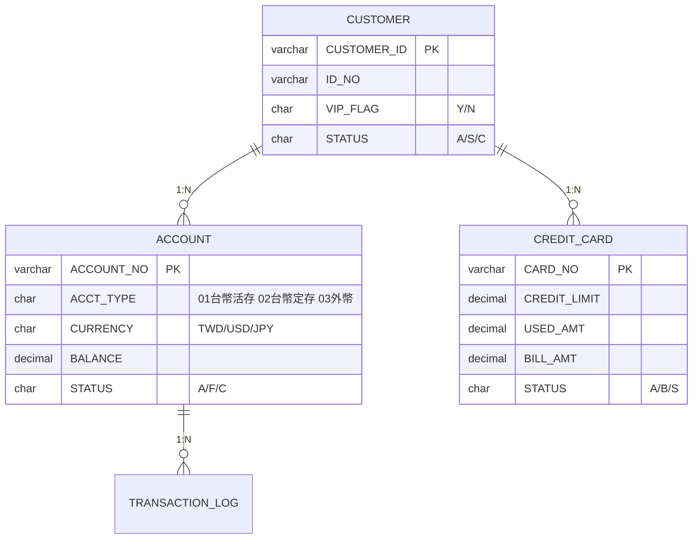
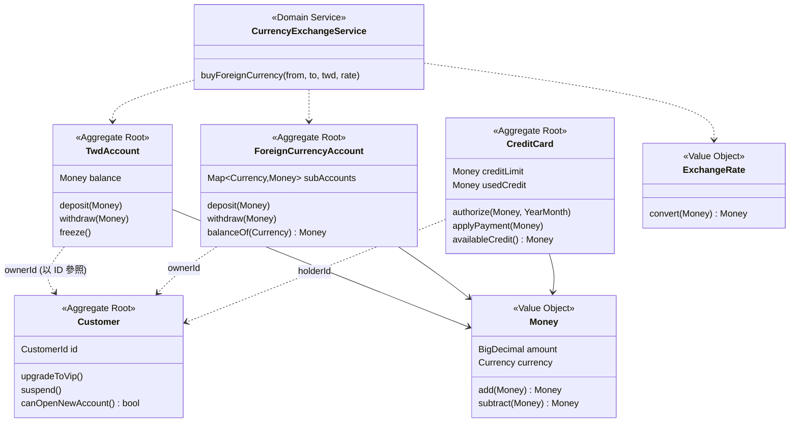

# Data Model vs. Domain Model — 以銀行客戶服務為例

以同一組銀行業務（**台幣帳戶、外幣帳戶、信用卡**）為標的，
用兩套可對照的 Java 程式碼，比較「資料導向（Data Model）」與「領域導向（Domain Model）」
兩種建模方式在 **程式架構** 與 **資料設計** 上的差異。

```
├── data-model-approach/      # 資料導向：資料表鏡射 + Transaction Script
│   ├── schema.sql
│   └── src/.../datamodel/
│       ├── entity/           # CustomerDO / AccountDO / CreditCardDO（貧血模型）
│       ├── dao/              # 資料表存取
│       └── service/          # BankingService —— 所有業務邏輯都在這裡
└── domain-model-approach/    # 領域導向：聚合 + Value Object + Domain Service
    └── src/.../domainmodel/
        ├── shared/           # Money / ExchangeRate（Value Object）
        ├── customer/         # Customer 聚合
        ├── account/          # TwdAccount / ForeignCurrencyAccount 聚合
        ├── card/             # CreditCard 聚合
        ├── service/          # 跨聚合的 Domain Service
        └── repository/       # Repository 介面（實作屬基礎設施層）
```

---

## 一、兩種模型的出發點

| | Data Model（資料模型） | Domain Model（領域模型） |
|---|---|---|
| 回答的問題 | 資料**長什麼樣、怎麼存**？ | 業務**是什麼、怎麼運作**？ |
| 設計起點 | ER 圖、資料表、欄位、正規化 | 業務概念、規則、通用語言（Ubiquitous Language） |
| 物件的角色 | 資料表的鏡射（DO/PO），只有 getter/setter | 業務概念的化身，有行為、守規則 |
| 業務邏輯位置 | 集中在 Service（Transaction Script） | 分佈在聚合、Value Object、Domain Service |
| 一句話 | **表驅動程式** | **業務驅動程式** |

兩者不是對錯之分，而是**優化目標不同**：Data Model 優化「存取與報表」，
Domain Model 優化「業務規則的表達與演進」。

---

## 二、資料設計比較

### Data Model：一張 ACCOUNT 表打天下



特徵（見 [`data-model-approach/schema.sql`](data-model-approach/schema.sql)）：

- 台幣與外幣帳戶**共用一張表**，靠 `ACCT_TYPE` + `CURRENCY` 欄位碼區分。
- 客戶「一戶多幣」的外幣綜合帳戶，只能拆成多列資料，概念在 schema 上消失。
- 金額（`BALANCE`）與幣別（`CURRENCY`）是兩個**互不相干的欄位**，資料庫不會阻止你把美元加進台幣餘額。
- 「可用額度 = CREDIT_LIMIT − USED_AMT」是隱含知識，表上看不出來。
- 業務規則（定存不能直接提領、外幣帳戶不收台幣）**完全不在資料層**，全靠應用程式自律。

### Domain Model：概念各自成型，資料是實作細節



特徵：

- 台幣帳戶、外幣帳戶、信用卡是**三個獨立的聚合（型別）**，不是同一張表的三種碼值。
- `Money` 把金額與幣別鎖在一起：`TWD 100 + USD 100` 直接拋 `CurrencyMismatchException`。
- 外幣帳戶「一戶多幣」是模型的第一級概念（`Map<Currency, Money>` 子帳）。
- 「可用額度」是**行為**（`availableCredit()`），定義只寫一次。
- 聚合之間只以 ID 相連（`CustomerId`），維持各自的交易邊界。
- 資料怎麼存由基礎設施層的 Repository 實作決定，領域層不知情——**依賴方向反轉**。

---

## 三、程式架構比較

### 同一個需求，兩種寫法

**需求：台幣結購外幣（換匯）**

Data Model 途徑（[`BankingService.buyForeignCurrency`](data-model-approach/src/main/java/com/bank/datamodel/service/BankingService.java)）——
一支 Transaction Script 把所有事做完：

```java
public void buyForeignCurrency(String twdAccountNo, String fxAccountNo,
                               BigDecimal twdAmount, BigDecimal exchangeRate) {
    AccountDO twd = accountDao.findByAccountNo(twdAccountNo);
    AccountDO fx  = accountDao.findByAccountNo(fxAccountNo);
    if (twd == null || fx == null) throw new IllegalArgumentException("帳戶不存在");
    if (!"01".equals(twd.getAcctType())) throw new IllegalArgumentException("扣款帳戶必須是台幣活存");
    if (!"03".equals(fx.getAcctType()))  throw new IllegalArgumentException("入帳帳戶必須是外幣帳戶");
    if (!"A".equals(twd.getStatus()) || !"A".equals(fx.getStatus())) ...
    if (twd.getBalance().compareTo(twdAmount) < 0) throw new IllegalStateException("台幣餘額不足");

    BigDecimal fxAmount = twdAmount.divide(exchangeRate, 2, RoundingMode.DOWN);
    twd.setBalance(twd.getBalance().subtract(twdAmount));
    fx.setBalance(fx.getBalance().add(fxAmount));
    accountDao.update(twd);
    accountDao.update(fx);
}
```

Domain Model 途徑（[`CurrencyExchangeService`](domain-model-approach/src/main/java/com/bank/domainmodel/service/CurrencyExchangeService.java)）——
Domain Service 只編排，規則各歸其位：

```java
public Money buyForeignCurrency(TwdAccount from, ForeignCurrencyAccount to,
                                Money twdAmount, ExchangeRate rate) {
    Money fxAmount = rate.convert(twdAmount);  // 換算方向錯誤 → ExchangeRate 擋
    from.withdraw(twdAmount);                  // 餘額不足、凍結 → TwdAccount 擋
    to.deposit(fxAmount);                      // 存入台幣、凍結 → ForeignCurrencyAccount 擋
    return fxAmount;
}
```

### 架構特性對照

| 面向 | Data Model 途徑 | Domain Model 途徑 |
|---|---|---|
| 分層 | Controller → Service → DAO → Table | Interface → Application → **Domain** → Infrastructure |
| 業務規則落點 | Service 方法內的 if/else，**同一規則多處重複**（deposit/withdraw 各檢查一次狀態） | 聚合唯一入口，**規則只寫一次**，呼叫端繞不過 |
| 不變量保護 | 靠工程師記得檢查；任何人 `setBalance()` 就能改出負餘額 | 建構子 + 行為方法把關；物件**不可能**進入非法狀態 |
| 型別安全 | `String acctType`、裸 `BigDecimal`：把卡號當帳號傳、美元加台幣，編譯期無感 | `AccountNumber`／`CardNumber`／`Money`：這類錯誤**編譯不過或立刻拋例外** |
| 新業務型態（例：加開數位帳戶） | ACCOUNT 加一個 `ACCT_TYPE=04`，然後**全域搜尋每個 if/else** 補分支 | 新增一個 `DigitalAccount` 聚合，既有程式碼不動（開放封閉） |
| 單元測試 | 邏輯綁在 Service + DAO，**要 mock 資料庫**才能測規則 | 聚合是純物件，`new` 出來直接測，**不需要任何 mock** |
| 併發控制粒度 | 以「資料列」思考，容易整批鎖表 | 以「聚合」為交易邊界，一次交易鎖一個聚合 |
| 團隊溝通 | 「把 ACCT_TYPE 03 的 BALANCE 減掉再 update」 | 「外幣帳戶提領美元子帳」——與業務單位**同一種語言** |

### 資料↔物件的對應關係

| | Data Model | Domain Model |
|---|---|---|
| 物件:資料表 | 1:1（AccountDO ↔ ACCOUNT） | 不必 1:1（一個聚合可對多張表；`Money` 攤平成兩欄） |
| 依賴方向 | 程式依賴資料表結構，**改表就改程式** | 領域層定義 Repository 介面，**儲存方式可抽換** |
| 衍生值 | 存欄位或每處重算（`USED_AMT`、可用額度） | 行為即定義（`availableCredit()`） |
| 狀態表達 | 魔術碼 `'A'/'F'/'C'` 散落各處 | `enum Status { ACTIVE, FROZEN, CLOSED }` |

---

## 四、什麼時候該用哪一種？

**適合 Data Model（Transaction Script）：**

- CRUD 為主、規則稀薄的功能：客戶基本資料維護、參數檔、報表查詢
- 批次與資料整併：日終計息、對帳、餘額匯總——本質就是集合運算，SQL 比物件快
- 查詢端（CQRS 的 Q 端）：畫面要的是扁平資料，不需要行為

**適合 Domain Model：**

- 規則密集、狀態機複雜的核心業務：授信審核、信用卡授權、換匯、風控
- 規則會持續演進的領域：今天「VIP 免手續費」、明天「數位帳戶限額」
- 不變量代價高的場景：餘額為負、超額授權——出錯就是**金錢損失**

**實務上的常見組合（同一套核心系統內並存）：**

| 業務 | 建議 | 理由 |
|---|---|---|
| 台幣/外幣「交易」（存提、換匯） | Domain Model | 不變量密集，出錯即損失 |
| 信用卡「授權/額度」 | Domain Model | 狀態機 + 額度規則持續變動 |
| 帳務「查詢/報表/對帳單」 | Data Model | 扁平讀取，SQL 直達最有效率 |
| 日終「批次計息」 | Data Model | 集合運算，逐物件處理反而慢 |

> 關鍵不是「哪個比較先進」，而是：**寫入端的複雜規則交給 Domain Model 守護，
> 讀取端與批次的大量資料交給 Data Model 直取**——這正是 CQRS 的精神。

---

## 五、延伸閱讀

- Eric Evans, *Domain-Driven Design*（藍皮書）— 聚合、Value Object、Repository 的出處
- Martin Fowler, *Patterns of Enterprise Application Architecture* — Transaction Script vs. Domain Model 兩個模式的原始定義
- Martin Fowler, [AnemicDomainModel](https://martinfowler.com/bliki/AnemicDomainModel.html) — 貧血模型為什麼是反模式
- Vaughn Vernon, *Implementing Domain-Driven Design*（紅皮書）— 聚合設計四原則（小聚合、以 ID 參照）
