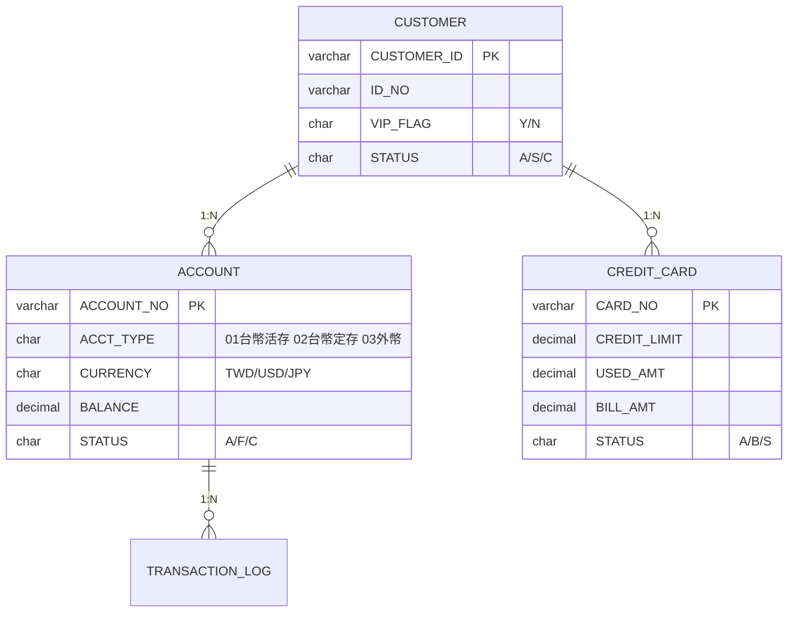
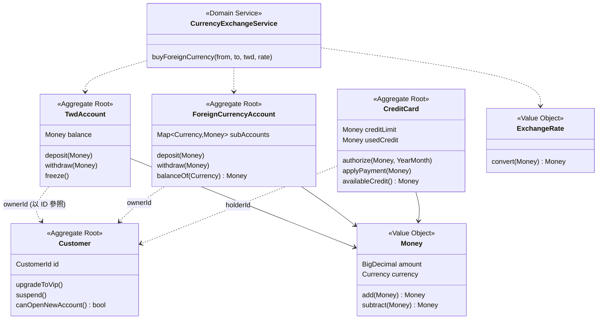
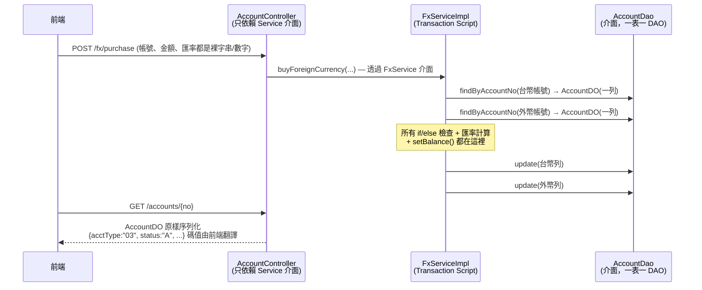
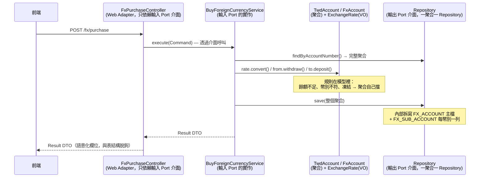
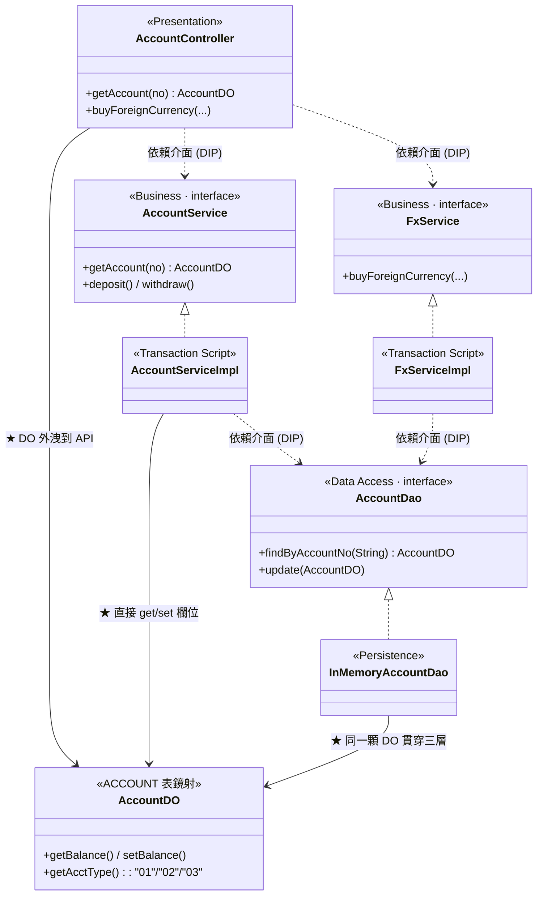
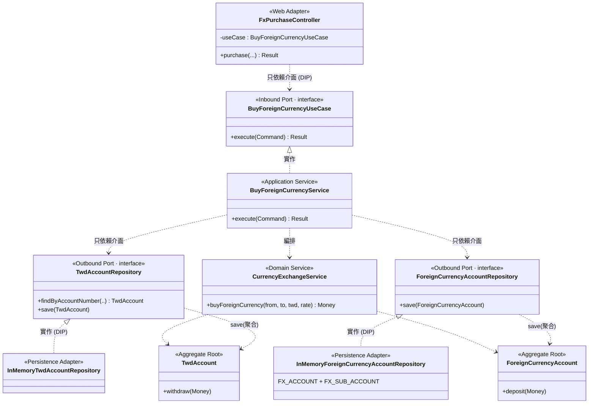
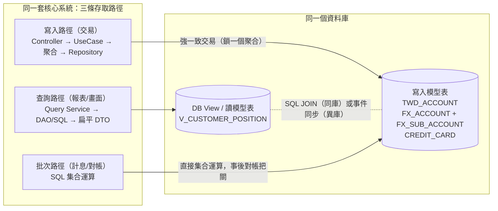
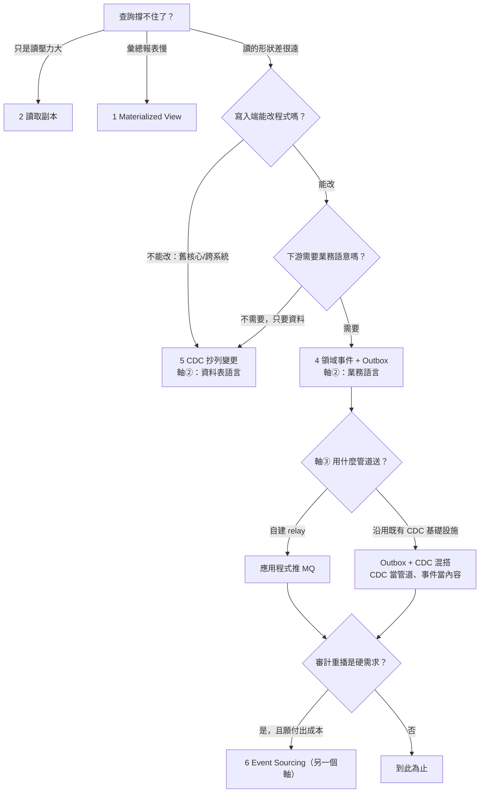

# Data Model vs. Domain Model — 以銀行客戶服務為例

以同一組銀行業務（**台幣帳戶、外幣帳戶、信用卡**）為標的，
用兩套**可執行、可測試**的 Java 程式碼，比較「資料導向（Data Model）」與「領域導向（Domain Model）」
兩種建模方式在 **程式架構** 與 **資料設計** 上的差異。

兩個模組共用**同一份中文 Gherkin 業務場景**（BDD），各自用 Cucumber 驗收自己的實作
——測試本身也是比較的一部分。

```
├── pom.xml                          # Maven 多模組（Cucumber + JUnit 5）
├── data-model-approach/             # 資料導向：三層式架構（SOLID 版）
│   ├── schema.sql                   #   設計起點：ER 圖與資料表
│   └── src
│       ├── main/.../datamodel/
│       │   ├── web/                 # Presentation：Controller 只依賴 Service「介面」
│       │   ├── service/             # Business 抽象：AccountService / FxService / CreditCardService
│       │   │   └── impl/            #   Transaction Script 實作（規則全在這）
│       │   ├── dao/                 # Data Access：一個 DAO 介面對應一張表，傳輸單位是「一列」
│       │   ├── entity/              # 貧血 DO（只有 getter/setter，貫穿三層）
│       │   └── demo/                # DataModelDemo —— 組裝根 + 可執行驗證
│       └── test/
│           ├── resources/features/  # 中文 Gherkin（與另一模組同一份）
│           └── java/.../bdd/        # Cucumber Step Definitions
└── domain-model-approach/           # 領域導向：六角架構（Ports & Adapters）
    └── src
        ├── main/.../domainmodel/
        │   ├── domain/              # ★ 純領域層，單獨抽離，不依賴其他任何層
        │   │   ├── model/
        │   │   │   ├── shared/      #   Money / ExchangeRate（Value Object）
        │   │   │   ├── customer/    #   Customer 聚合
        │   │   │   ├── account/     #   TwdAccount / ForeignCurrencyAccount 聚合
        │   │   │   └── card/        #   CreditCard 聚合
        │   │   ├── service/         #   跨聚合的 Domain Service
        │   │   └── repository/      #   輸出 Port：一個 Repository 介面對應「一個聚合」
        │   ├── application/
        │   │   ├── port/in/         #   輸入 Port：BuyForeignCurrencyUseCase（介面）
        │   │   └── service/         #   BuyForeignCurrencyService（Port 實作，只編排）
        │   ├── adapter/
        │   │   ├── in/web/          #   FxPurchaseController —— 只依賴輸入 Port 介面
        │   │   └── out/persistence/ #   Repository 實作：一個聚合 ↔ 多張表
        │   └── bootstrap/           #   組裝根（Composition Root）+ 可執行驗證
        └── test/                    # 同一份 Gherkin + 自己的 Step Definitions
```

## 快速上手（初學者請從這裡開始）

### 0. 環境需求

| 需求 | 版本 | 檢查指令 |
|---|---|---|
| JDK | **21 或以上** | `java -version` |
| Maven | 3.9 或以上 | `mvn -version` |
| 資料庫 | **不需要** | 儲存層用 `HashMap` 模擬（`InMemory*` 系列類別） |

> 專案是純 Java + Maven，沒有 Spring、沒有 DB、沒有網路呼叫。
> 第一次執行 `mvn test` 會下載 Cucumber / JUnit 相依套件，需要連網；之後就能離線跑。

### 1. 三分鐘跑起來

```bash
# ① 跑 BDD 驗收測試：兩個模組各 8 個 Cucumber 場景（同一份 Gherkin）
mvn test
```

看到這兩行就代表兩種架構都通過了**同一份業務驗收**：

```
[INFO] Tests run: 8, Failures: 0, Errors: 0, Skipped: 0 -- in com.bank.datamodel.bdd.CucumberTest
[INFO] Tests run: 8, Failures: 0, Errors: 0, Skipped: 0 -- in com.bank.domainmodel.bdd.CucumberTest
[INFO] BUILD SUCCESS
```

測試過程會把每個場景的中文步驟印在畫面上（`pretty` plugin），
同時各產生一份可用瀏覽器開啟的報表：

```
data-model-approach/target/cucumber-report.html
domain-model-approach/target/cucumber-report.html
```

```bash
# ② 跑端到端 Demo（需先 mvn test 或 mvn compile 產出 target/classes）
java -cp data-model-approach/target/classes   com.bank.datamodel.demo.DataModelDemo
java -cp domain-model-approach/target/classes com.bank.domainmodel.bootstrap.DomainModelDemo
```

兩支 Demo 跑的是**同一筆換匯交易**，但結尾刻意展示相反的東西——
Data Model 側示範「規則守不住」，Domain Model 側示範「規則守得住」：

<table>
<tr><th>DataModelDemo（節錄結尾）</th><th>DomainModelDemo（節錄結尾）</th></tr>
<tr><td><pre>=== [資料洞示範] 繞過 Service 直接操作 DO ===
  setBalance(-50000) 後餘額 = -50000
      ← 不變量已被破壞
  台幣 1000 誤加進 USD 帳戶餘額 = 2000.00
      ← 幣別錯帳，編譯期與執行期都無感</pre></td>
<td><pre>=== [不變量驗證] 非法操作在模型層就被擋下 ===
  1. 提款超過餘額 → 餘額不足：…
  2. 台幣 + 美元   → 幣別不一致: TWD vs USD
  3. 台幣存入外幣帳戶 → 外幣帳戶不可存入台幣
  4. 刷卡超過額度 → 超過可用額度：…
（這一側不存在 setBalance()，負餘額寫不出來，編譯就失敗）</pre></td></tr>
</table>

### 2. 常用指令速查

| 目的 | 指令 |
|---|---|
| 跑全部測試（兩個模組） | `mvn test` |
| 只跑 Data Model 模組 | `mvn test -pl data-model-approach` |
| 只跑 Domain Model 模組 | `mvn test -pl domain-model-approach` |
| **只跑某一個場景** | `mvn test -pl domain-model-approach -Dcucumber.filter.name="餘額足夠時結購成功"` |
| 只跑信用卡相關的三個場景 | `mvn test -Dcucumber.filter.name=".*刷卡.*\|.*額度.*\|.*掛失.*"` |
| 只編譯不跑測試 | `mvn compile` |
| 清掉建置產物重跑 | `mvn clean test` |

> `-Dcucumber.filter.name` 吃的是**必須匹配整個場景名稱**的正規式——
> 想用關鍵字篩選要自己補 `.*`（寫 `刷卡` 會一個都不中，要寫 `.*刷卡.*`）。
> 沒被選中的場景會顯示為 `Skipped`，屬正常現象（例：`Tests run: 8, Failures: 0, Skipped: 7`）。

### 3. 遇到問題時

| 症狀 | 原因與解法 |
|---|---|
| `invalid target release: 21` | JDK 版本太舊。本專案 `maven.compiler.release=21`，請裝 JDK 21+ 並確認 `JAVA_HOME` |
| `ClassNotFoundException` 執行 Demo 時 | 還沒編譯。先跑 `mvn test` 或 `mvn compile` 產出 `target/classes` |
| 終端機中文變亂碼（常見於 Windows） | 終端機切 UTF-8：`chcp 65001`，或執行時加 `java -Dfile.encoding=UTF-8 -cp ...` |
| 第一次 `mvn test` 卡在下載 | 正在抓 Cucumber/JUnit 套件，等它跑完；之後可加 `-o` 離線執行 |
| 想確認測試真的有在驗證 | 故意把某個 feature 的期望值改錯（例 `5000` 改 `9999`）再跑一次，應該要**紅燈**——見第四節「看懂一次失敗」 |

### 4. 建議閱讀順序

1. 先讀兩邊的「模型」：[`schema.sql`](data-model-approach/schema.sql)（Data Model 的起點）
   ↔ [`domain/model/`](domain-model-approach/src/main/java/com/bank/domainmodel/domain/model)（Domain Model 的起點）。
2. 讀業務場景：`src/test/resources/features/*.feature`（兩模組同一份，共 8 個場景，
   完整清單見**第四節**），再對照兩邊的 Step Definitions（`DataModelSteps` ↔ `DomainModelSteps`）。
3. 順著一筆換匯交易走完各自的分層（見第三節的循序圖與 Class Diagram）。
4. 跑兩支 Demo，看 Data Model 側的「資料洞示範」與 Domain Model 側的「不變量驗證」輸出。
5. 做第四節末的**動手練習**：改一個場景讓它變紅，再自己補一個新場景讓它變綠。

### 5. 如何在此架構上加新功能（以「新增『台幣轉帳』」為例）

| 步驟 | data-model-approach（三層式） | domain-model-approach（六角） |
|---|---|---|
| 1 | 在 `features/` 寫 Gherkin 場景 | 同左（同一份） |
| 2 | `service/` 加 `TransferService` 介面 | `domain/model/account/` 為 `TwdAccount` 加 `transferTo()` 行為（或不用改） |
| 3 | `service/impl/` 寫 Transaction Script | `application/port/in/` 加 `TransferUseCase` 介面；`application/service/` 實作編排 |
| 4 | Controller 注入新介面 | `adapter/in/web/` 的 Controller 注入新輸入 Port |
| 5 | 補 Step Definitions → `mvn test` | 同左 |

---

## 一、兩種模型的出發點

| | Data Model（資料模型） | Domain Model（領域模型） |
|---|---|---|
| 回答的問題 | 資料**長什麼樣、怎麼存**？ | 業務**是什麼、怎麼運作**？ |
| 設計起點 | ER 圖、資料表、欄位、正規化 | 業務概念、規則、通用語言（Ubiquitous Language） |
| 物件的角色 | 資料表的鏡射（DO/PO），只有 getter/setter | 業務概念的化身，有行為、守規則 |
| 業務邏輯位置 | 集中在 Service（Transaction Script） | 分佈在聚合、Value Object、Domain Service |
| 一句話 | **表驅動程式** | **業務驅動程式** |

出發點不同，但**設計結果會體現在每一層**。第三節以同一個使用情境把兩邊的三層全部攤開對照。

---

## 二、資料設計比較

### Data Model：一張 ACCOUNT 表打天下



特徵（見 [`data-model-approach/schema.sql`](data-model-approach/schema.sql)）：

- 台幣與外幣帳戶**共用一張表**，靠 `ACCT_TYPE` + `CURRENCY` 欄位碼區分。
- 客戶「一戶多幣」的外幣綜合帳戶，只能拆成多列資料，概念在 schema 上消失。
- 金額（`BALANCE`）與幣別（`CURRENCY`）是兩個**互不相干的欄位**，資料庫不會阻止你把美元加進台幣餘額。
- 「可用額度 = CREDIT_LIMIT − USED_AMT」是隱含知識，表上看不出來。
- 業務規則（定存不能直接提領、外幣帳戶不收台幣）**完全不在資料層**，全靠應用程式自律。

### Domain Model：概念各自成型，資料是實作細節



特徵：

- 台幣帳戶、外幣帳戶、信用卡是**三個獨立的聚合（型別）**，不是同一張表的三種碼值。
- `Money` 把金額與幣別鎖在一起：`TWD 100 + USD 100` 直接拋 `CurrencyMismatchException`。
- 外幣帳戶「一戶多幣」是模型的第一級概念（`Map<Currency, Money>` 子帳）。
- 「可用額度」是**行為**（`availableCredit()`），定義只寫一次。
- 聚合之間只以 ID 相連（`CustomerId`），維持各自的交易邊界。
- 資料怎麼存由基礎設施層的 Repository 實作決定，領域層不知情——**依賴方向反轉**。

---

## 三、同一個使用情境，走完三層：前端 → Business → Repository

使用情境：**客戶用台幣帳戶 32,500 元，以匯率 32.5 結購美元 1,000 元存入外幣帳戶。**

### Data Model 途徑的三層



### Domain Model 途徑的三層



### Class Diagram：兩邊都遵守 SOLID，分水嶺在「模型」

兩個途徑的類別相依**都已介面化**（Controller 依賴 Service 介面、實作依賴 DAO／Repository 介面）。
真正的差異在**每一層傳遞的東西**：Data Model 是同一顆 `AccountDO` 貫穿三層；
Domain Model 是每層有自己的模型（Command/DTO ↔ 聚合 ↔ Row）。

**Data Model 途徑（三層式，SOLID 版）**——介面都對了，
但 `AccountDO`（＝ACCOUNT 表的鏡射）仍然貫穿三層、外洩到 API 契約：



**Domain Model 途徑（嚴格 SOLID）**——前端 Adapter 與 Repository 實作**都指向核心**：
Web 依賴輸入 Port「介面」，Infrastructure 實作輸出 Port「介面」；
核心（application + domain）不 import 任何 Adapter，兩端可獨立抽換：



實際 import 驗證（程式碼與圖一致）：

- [`FxPurchaseController`](domain-model-approach/src/main/java/com/bank/domainmodel/adapter/in/web/FxPurchaseController.java) 只 import `application.port.in.BuyForeignCurrencyUseCase`——不認識 Service 實作、聚合、Repository。
- [`InMemoryForeignCurrencyAccountRepository`](domain-model-approach/src/main/java/com/bank/domainmodel/adapter/out/persistence/InMemoryForeignCurrencyAccountRepository.java) 只 import 領域層（Repository 介面＋聚合）——不認識 application 與 web。
- 介面與實作只在**組裝根**（[`DomainModelDemo`](domain-model-approach/src/main/java/com/bank/domainmodel/bootstrap/DomainModelDemo.java) 的 main、或 Spring 的 DI 容器）相遇。

### SOLID 逐條對應：兩邊怎麼各自滿足，以及 SOLID 修不了什麼

| 原則 | Data Model（三層式作法） | Domain Model（六角作法） |
|---|---|---|
| **S**RP | 上帝類別拆成 `AccountService` / `FxService` / `CreditCardService`，一個業務域一個類別 | Controller 只轉譯、UseCase 只編排、聚合只守自己的規則、Repository 實作只管存取 |
| **O**CP | 加新「業務」＝加新 Service 介面＋實作，既有類別不動 | 加新「業務型態」＝新增聚合＋新 Port，既有類別不動 |
| **L**SP | 任何 `AccountDao` 實作（in-memory/JDBC/MyBatis）可互換，Service 行為不變 | 任何 Repository 實作可互換，UseCase 行為不變——BDD 測試就是替換證明 |
| **I**SP | 一個業務域一個小介面，Controller 只注入用得到的 | 一個 Use Case 一個輸入 Port；一個聚合一個輸出 Port |
| **D**IP | Controller → Service **介面**；ServiceImpl → DAO **介面** | 前端 Adapter → 輸入 Port 介面；Repository 實作 → 輸出 Port 介面，箭頭全部指向核心 |

> **SOLID 是類別關係的紀律，不是建模範式**——兩邊都能合規。合規之後仍然消不掉的差異，才是
> Data Model vs. Domain Model 的本質：
> 1. **模型貫穿 vs. 每層一模**：`AccountDO` 從 DAO 一路裸奔到 API；六角側是 Command/DTO ↔ 聚合 ↔ Row，各層解耦。
> 2. **規則的落點**：三層式規則仍在 Service 的 if/else（`OCP` 只保護「加業務」，「加帳戶型態 `ACCT_TYPE=04`」
>    還是得回頭改 `AccountServiceImpl` 的分支）；六角側加型態＝加聚合。
> 3. **不變量保護**：`AccountDO.setBalance(-50000)` 依然任何人都寫得出來（Demo 有實證）；聚合側沒有 setter。
> 4. **Repository 粒度**：DAO ↔ 表（傳一列）；Repository ↔ 聚合（傳整個聚合，表數是實作細節）。

### 逐層對照（每一格都有對應的程式檔可驗證）

| 層 | Data Model 途徑 | Domain Model 途徑 |
|---|---|---|
| **前端呈現** | [`AccountController`](data-model-approach/src/main/java/com/bank/datamodel/web/AccountController.java) 依賴 Service **介面**（DIP），但把 `AccountDO` 原樣回傳：畫面拿到 `acctType:"03"`、`status:"A"`，自己查碼表翻譯。**API 契約 = 資料表 schema**，改表即改 API | [`FxPurchaseController`](domain-model-approach/src/main/java/com/bank/domainmodel/adapter/in/web/FxPurchaseController.java) 只依賴[輸入 Port 介面](domain-model-approach/src/main/java/com/bank/domainmodel/application/port/in/BuyForeignCurrencyUseCase.java)，回傳語意化 DTO（`purchasedFxAmount: "USD 1000.00"`）。聚合不外洩，**API 契約與儲存結構脫鉤** |
| **Business Layer** | [`FxServiceImpl`](data-model-approach/src/main/java/com/bank/datamodel/service/impl/FxServiceImpl.java) 等 Transaction Script 做完載入、檢查、計算、寫回；同類檢查跨 Service 重複 | [`BuyForeignCurrencyService`](domain-model-approach/src/main/java/com/bank/domainmodel/application/service/BuyForeignCurrencyService.java) 實作輸入 Port、只編排（載入→呼叫領域行為→存回→轉 DTO）；規則在聚合與 `ExchangeRate` 裡，各寫一次 |
| **Repository Layer** | **一個 DAO ↔ 一張表**，傳輸單位是「一列 DO」；跨表一致性由 Service 呼叫兩次 `update()` 自行維持 | **一個 Repository ↔ 一個聚合**，`save()` 傳入**整個聚合**；[`InMemoryForeignCurrencyAccountRepository`](domain-model-approach/src/main/java/com/bank/domainmodel/adapter/out/persistence/InMemoryForeignCurrencyAccountRepository.java) 內部拆寫 `FX_ACCOUNT` + `FX_SUB_ACCOUNT` 兩張表，呼叫端毫不知情 |

> **Repository 粒度是兩者最本質的差異之一**：
> Data Model 的 DAO 與資料表一一對應（`AccountDao ↔ ACCOUNT`），聚合這個概念不存在；
> Domain Model 的 Repository 與**聚合**一一對應，聚合對應幾張表是基礎設施的私事——
> `TwdAccount` 剛好一張表、`ForeignCurrencyAccount` 是主檔+子帳兩張表，
> 但兩個 Repository 的契約長得一模一樣：`save(聚合)` / `findBy...() → 聚合`。
> 交易與一致性邊界因此從「Service 方法」移到「聚合」身上。

兩邊各附一支可執行 Demo 驗證上述行為（含 Data Model 途徑「繞過 Service 寫出負餘額、幣別錯帳」的資料洞示範）：
[`DataModelDemo`](data-model-approach/src/main/java/com/bank/datamodel/demo/DataModelDemo.java)、
[`DomainModelDemo`](domain-model-approach/src/main/java/com/bank/domainmodel/bootstrap/DomainModelDemo.java)。

---

## 四、從測試出發：Gherkin → Cucumber → prod. code

BDD 的走法：先用業務語言寫**測試案例**（Gherkin），再寫**測試程式**（Cucumber Step Definitions），
最後讓 **prod. code** 通過驗收。本專案的關鍵設計：**兩個模組共用同一份 Gherkin**——
業務場景與實作方式無關，但 Step Definitions 的長相立刻暴露兩種架構的差異。

### 4-1. 一個測試由三個檔案組成

初學者最容易卡住的是「測試到底寫在哪」。Cucumber 把一個測試拆成三份，各有各的語言：

```
① 測試案例（業務語言，PM/業務也讀得懂）
   src/test/resources/features/*.feature          ← 兩個模組共用同一份
        │  「假設 客戶 "C000001" 的台幣帳戶 ... 餘額為 100000 元」
        │
        ▼  Cucumber 用字串比對，把每一句話對上一個 Java 方法
② 測試程式（膠水層，把業務語言翻成程式呼叫）
   src/test/java/.../bdd/DataModelSteps.java      ← 每個模組自己一份
   src/test/java/.../bdd/DomainModelSteps.java       ★ 兩邊的差異就在這裡顯現
        │  @Given("客戶 {string} 的台幣帳戶 {string} 餘額為 {int} 元")
        │
        ▼
③ prod. code（受測的正式程式）
   data-model-approach   : AccountServiceImpl / FxServiceImpl / …
   domain-model-approach : TwdAccount / ForeignCurrencyAccount / CreditCard / …

＋ 啟動器：src/test/java/.../bdd/CucumberTest.java
   一個空類別，用標註告訴 JUnit「去 features/ 找場景、去這個 package 找 Step 定義」。
```

**中文 Gherkin 關鍵字**（檔案第一行的 `# language: zh-TW` 開啟中文模式）：

| 中文 | 英文 | 意思 | 在本專案的角色 |
|---|---|---|---|
| `功能` | `Feature` | 這份檔案在測哪個業務功能 | 三個檔：換匯、台幣存提、信用卡授權 |
| `場景` | `Scenario` | 一個具體測試案例 | 共 8 個，一個場景 = 一個測試 |
| `假設` | `Given` | **前置狀態**（Arrange） | 建立帳戶／卡片、設定餘額與狀態 |
| `當` | `When` | **執行動作**（Act） | 存款、提款、結購外幣、刷卡 |
| `那麼` | `Then` | **驗證結果**（Assert） | 餘額對不對、有沒有被正確拒絕 |
| `並且` | `And` | 延續上一個關鍵字 | 接在 `假設`／`那麼` 後面補條件或斷言 |

### 4-2. 完整測試案例清單（8 個場景）

三支 feature 檔，**兩個模組內容完全相同**（可用 `diff` 驗證），共 8 個場景：

**A. 換匯 —— [`currency_exchange.feature`](domain-model-approach/src/test/resources/features/currency_exchange.feature)**

| # | 場景 | 前置（假設） | 動作（當） | 預期（那麼） | 這條規則由誰守 |
|---|---|---|---|---|---|
| 1 | 餘額足夠時結購成功 | 台幣帳戶餘額 100,000；有外幣帳戶 | 以匯率 32.5 用台幣 32,500 結購美元 | 成功；台幣剩 **67,500**；美元子帳 **1,000** | Data：`FxServiceImpl`<br>Domain：`ExchangeRate.convert()` + 兩個聚合 |
| 2 | 台幣餘額不足時拒絕交易 | 台幣帳戶餘額 **10,000**；有外幣帳戶 | 同上（要扣 32,500） | 被拒，訊息含「餘額不足」；台幣**維持 10,000**（不可被扣一半） | Data：`FxServiceImpl` 的 `if` 檢查<br>Domain：`TwdAccount.withdraw()` 拋 `InsufficientBalanceException` |

> 場景 2 的第二個斷言是重點：驗證交易被拒後**沒有留下半套資料**。

**B. 台幣帳戶存提款 —— [`twd_account.feature`](domain-model-approach/src/test/resources/features/twd_account.feature)**

| # | 場景 | 前置（假設） | 動作（當） | 預期（那麼） | 這條規則由誰守 |
|---|---|---|---|---|---|
| 3 | 存款入帳 | 台幣帳戶餘額 0 | 存入 5,000 | 餘額 **5,000** | Data：`AccountServiceImpl.deposit()`<br>Domain：`TwdAccount.deposit()` |
| 4 | 提款超過餘額被拒絕 | 台幣帳戶餘額 3,000 | 提領 5,000 | 被拒，訊息含「餘額不足」；餘額**維持 3,000** | Data：`AccountServiceImpl.withdraw()` 的 `if`<br>Domain：`TwdAccount.withdraw()` |
| 5 | 凍結帳戶不可提款 | 餘額 3,000，且**帳戶已凍結** | 提領 1,000（額度內） | 被拒，訊息含「不允許交易」 | Data：`status != "A"` 的字串比對<br>Domain：`assertActive()` 檢查 `enum Status.FROZEN` |

> 場景 5 專門測「餘額夠但狀態不允許」——把**額度檢查**與**狀態檢查**兩條規則分開驗證。

**C. 信用卡授權 —— [`credit_card.feature`](domain-model-approach/src/test/resources/features/credit_card.feature)**

| # | 場景 | 前置（假設） | 動作（當） | 預期（那麼） | 這條規則由誰守 |
|---|---|---|---|---|---|
| 6 | 額度內刷卡授權成功 | 持卡，額度 50,000 | 刷卡 48,000 | 授權成功；可用額度 **2,000** | Data：`creditLimit - usedAmt` 現算<br>Domain：`CreditCard.availableCredit()` |
| 7 | 超過可用額度授權失敗 | 額度 50,000，**已刷 48,000** | 再刷 5,000 | 被拒，訊息含「超過可用額度」；可用額度**仍是 2,000** | Data：`CreditCardServiceImpl` 的 `if`<br>Domain：`CreditCard.authorize()` 拋 `CreditLimitExceededException` |
| 8 | 掛失卡不可交易 | 持卡，**已掛失** | 刷卡 100（額度綽綽有餘） | 授權被拒 | Data：`status != "A"`<br>Domain：`status != Status.ACTIVE` |

> 場景 6→7 是一組：先建立「用掉 48,000」的狀態，再驗證下一筆被擋，
> 且**失敗的交易不會偷偷扣掉額度**（可用額度仍是 2,000）。
> 場景 8 刷 100 元是刻意的——金額小到不可能超額，失敗只可能來自卡片狀態。

**測試案例的覆蓋設計**：8 個場景刻意成對出現——
每個業務動作都有 **1 個成功路徑（happy path）** 與 **1～2 個被拒路徑**，
且每個被拒路徑都額外斷言「**狀態沒有被改壞**」。
這正是本專案的論點所在：Data Model 側靠 Service 的 `if` 守住這些規則，
Domain Model 側靠聚合守住——**兩邊都能通過同一份驗收，差別在於規則寫在哪、能不能被繞過**。

### 4-3. 執行結果

`mvn test` 兩個模組全數通過：

```
Tests run: 8, Failures: 0, Errors: 0, Skipped: 0 -- in com.bank.datamodel.bdd.CucumberTest
Tests run: 8, Failures: 0, Errors: 0, Skipped: 0 -- in com.bank.domainmodel.bdd.CucumberTest
```

畫面上每個場景會逐句列出，右側是實際對應到的 Java 方法（這是 `pretty` plugin 的輸出）：

```
場景: 餘額足夠時結購成功                       # features/currency_exchange.feature:7
  假設客戶 "C000001" 的台幣帳戶 "0011223344556" 餘額為 100000 元  # …DomainModelSteps.建立台幣帳戶(String,String,int)
  並且客戶 "C000001" 擁有外幣帳戶 "0099887766554"                # …DomainModelSteps.建立外幣帳戶(String,String)
  當以匯率 32.5 用台幣 32500 元結購美元                          # …DomainModelSteps.結購美元(BigDecimal,int)
  那麼交易成功                                                # …DomainModelSteps.交易成功()
  並且台幣帳戶餘額應為 67500 元                                 # …DomainModelSteps.驗證台幣餘額(int)
  並且外幣帳戶的美元子帳餘額應為 1000 美元                        # …DomainModelSteps.驗證美元子帳餘額(int)
```

同時產出 `*/target/cucumber-report.html`，用瀏覽器打開可以看到彩色的通過／失敗清單。

### 4-4. 同一步驟，兩種 Step Definition

「假設 客戶持有信用卡 額度 50000 元」這一步——

[Data Model 側](data-model-approach/src/test/java/com/bank/datamodel/bdd/DataModelSteps.java)：
測試被迫講「資料表方言」，手工組欄位碼；規則要經過 Service + DAO 才測得到。

```java
@Given("客戶 {string} 持有信用卡 {string} 額度 {int} 元")
public void 建立信用卡(String customerId, String cardNo, int limit) {
    CreditCardDO row = new CreditCardDO();
    row.setCardNo(cardNo);
    row.setCustomerId(customerId);
    row.setCardType("02");                      // 欄位碼：測試也得知道 02 是金卡
    row.setCreditLimit(new BigDecimal(limit));
    row.setUsedAmt(BigDecimal.ZERO);            // 漏設任何一欄，測的就不是真實狀態
    row.setBillAmt(BigDecimal.ZERO);
    row.setStatus("A");
    row.setExpireDate(LocalDate.of(2030, 12, 31));
    cardDao.insert(row);
}
```

[Domain Model 側](domain-model-approach/src/test/java/com/bank/domainmodel/bdd/DomainModelSteps.java)：
測試講的語言就是 prod. code 的語言，Gherkin 一句對應一個領域行為。

```java
@Given("客戶 {string} 持有信用卡 {string} 額度 {int} 元")
public void 建立信用卡(String customerId, String cardNo, int limit) {
    card = new CreditCard(new CardNumber(cardNo), new CustomerId(customerId),
            Money.twd(String.valueOf(limit)), YearMonth.of(2030, 12));
}

@Given("該卡已掛失")
public void 掛失() {
    card.reportLost();          // 對照組：Data Model 側是 row.setStatus("B")
}
```

| 測試面向 | Data Model | Domain Model |
|---|---|---|
| Given 的準備工作 | 組資料列、填欄位碼（`"02"`、`"A"`、`"B"`） | `new` 聚合、呼叫領域行為（`reportLost()`） |
| 規則的受測單位 | 只能整條 Service 流程一起測 | 聚合可單獨測，UseCase 另測編排 |
| 測試與業務語言的距離 | Gherkin 說「掛失」，程式寫 `setStatus("B")` | Gherkin 說「掛失」，程式寫 `reportLost()` |
| 需要的基礎設施 | DAO（真 DB 或 mock/in-memory） | 純物件即可；Repository 只在 UseCase 級測試出現 |

### 4-5. 看懂一次失敗

測試永遠通過，就無法確定它真的在驗證東西。動手把 `twd_account.feature` 的
「存款入帳」期望值從 `5000` 改成 `9999`，再跑 `mvn test -pl domain-model-approach`：

```
場景: 存款入帳                                   # features/twd_account.feature:7
  假設客戶 "C000001" 的台幣帳戶 "0011223344556" 餘額為 0 元
  當存入台幣 5000 元
  那麼台幣帳戶餘額應為 9999 元
      org.opentest4j.AssertionFailedError: expected: <TWD 9999.00> but was: <TWD 5000.00>
        at com.bank.domainmodel.bdd.DomainModelSteps.驗證台幣餘額(DomainModelSteps.java:144)
        at ✽.台幣帳戶餘額應為 9999 元(classpath:features/twd_account.feature:10)

[ERROR] Tests run: 8, Failures: 1, Errors: 0, Skipped: 0
```

失敗訊息從下往上讀最快：

| 這一行 | 告訴你什麼 |
|---|---|
| `at ✽.台幣帳戶餘額應為 9999 元(...feature:10)` | ✽ 開頭的是 **Gherkin 那一行**——業務語言的失敗點（feature 檔第 10 行） |
| `at ...DomainModelSteps.驗證台幣餘額(...:144)` | 對應的 **Step Definition** 方法與行號 |
| `expected: <TWD 9999.00> but was: <TWD 5000.00>` | 期望值 vs 實際值。注意實際值是 **`TWD 5000.00`** 而不是裸的 `5000`——`Money` 把幣別一起印出來了 |

> 對照 Data Model 側同一個失敗會印 `expected: <0> but was: <-1>`（`BigDecimal.compareTo` 的結果），
> 看不出幣別、也看不出金額——這就是「型別有沒有語意」在**除錯體驗**上的差別。
>
> 看完記得把 `9999` 改回 `5000`。

### 4-6. 動手練習

依難度排序，每一題都能在 5～20 分鐘內完成：

| # | 練習 | 要動的檔案 | 會學到什麼 |
|---|---|---|---|
| 1 | 把「存款入帳」的期望值改錯再改回來 | `features/twd_account.feature` | 測試真的有在驗證；看懂失敗訊息 |
| 2 | 新增場景：**存款 0 元應被拒絕** | 兩個模組的 `*.feature` + 兩個 `*Steps.java` | Domain 側已有 `isPositive()` 檢查會直接通過；Data 側 `AccountServiceImpl.deposit()` **沒有這條檢查**——你得自己補 |
| 3 | 新增場景：**外幣帳戶不可存入台幣** | 同上 | Domain 側 `ForeignCurrencyAccount.deposit()` 一行就擋掉；Data 側要在 `AccountServiceImpl` 補 `if`，而且**只擋得住走 Service 的路徑** |
| 4 | 在 `DataModelDemo` 裡試著複製「資料洞」到 Domain 側：呼叫 `twdAccount.setBalance(-50000)` | `DomainModelDemo.java` | **編譯就失敗**——聚合沒有 setter。這是全專案最直觀的一課 |
| 5 | 幫信用卡加「效期已過不可刷卡」場景 | `features/credit_card.feature` + Steps | Domain 側 `CreditCard.authorize()` 已有 `today.isAfter(expiry)` 檢查；Data 側 `CreditCardServiceImpl` **完全沒檢查 `expireDate`**——親眼看到「規則散落時會漏掉一條」 |

> 練習 2、3、5 有個共同結果：**Domain Model 側常常不用改 prod. code 就綠燈，
> Data Model 側則要回頭補 `if`**。這不是巧合——規則寫在聚合裡，
> 新場景多半只是「驗證早就存在的不變量」；規則散在 Service 裡，新場景往往是「發現漏了一處」。

新增場景的標準步驟：

1. 在**兩個模組**的同名 `.feature` 檔加上場景（保持兩份完全相同，可用
   `diff data-model-approach/src/test/resources/features/twd_account.feature domain-model-approach/src/test/resources/features/twd_account.feature`
   檢查）。
2. 跑 `mvn test`——若用到全新的步驟句型，Cucumber 會報錯並**直接給你待實作的標註**：

   ```
   io.cucumber.junit.platform.engine.UndefinedStepException:
   The step '客戶 "C000001" 開立了一個尚未實作的帳戶 "0011223344556"' is undefined.
   You can implement this step using the snippet(s) below:
   @假設("客戶 {string} 開立了一個尚未實作的帳戶 {string}")
   ```

   > Cucumber 建議的是中文標註 `@假設`（來自 `io.cucumber.java.zh_tw`），
   > 本專案則統一用英文的 `@Given` / `@When` / `@Then`（`io.cucumber.java.en`）——
   > **兩種都能用**，句型字串一樣就會對上；跟著現有檔案的寫法即可。

3. 把方法貼進 `DataModelSteps.java` 與 `DomainModelSteps.java`，各自實作
   （`{string}` → `String` 參數、`{int}` → `int`、`{bigdecimal}` → `BigDecimal`）。
4. 再跑 `mvn test`，直到兩邊都綠燈。

---

## 五、架構特性對照

| 面向 | Data Model 途徑 | Domain Model 途徑 |
|---|---|---|
| 分層 | Controller → Service → DAO → Table | Interface → Application → **Domain** → Infrastructure |
| 業務規則落點 | Service 方法內的 if/else，**同一規則多處重複**（deposit/withdraw 各檢查一次狀態） | 聚合唯一入口，**規則只寫一次**，呼叫端繞不過 |
| 不變量保護 | 靠工程師記得檢查；任何人 `setBalance()` 就能改出負餘額（Demo 有實證） | 建構子 + 行為方法把關；物件**不可能**進入非法狀態（沒有 setter） |
| 型別安全 | `String acctType`、裸 `BigDecimal`：把卡號當帳號傳、美元加台幣，編譯期無感 | `AccountNumber`／`CardNumber`／`Money`：這類錯誤**編譯不過或立刻拋例外** |
| 新業務型態（例：加開數位帳戶） | ACCOUNT 加一個 `ACCT_TYPE=04`，然後**全域搜尋每個 if/else** 補分支 | 新增一個 `DigitalAccount` 聚合，既有程式碼不動（開放封閉） |
| 併發控制粒度 | 以「資料列」思考，容易整批鎖表 | 以「聚合」為交易邊界，一次交易鎖一個聚合 |
| 團隊溝通 | 「把 ACCT_TYPE 03 的 BALANCE 減掉再 update」 | 「外幣帳戶提領美元子帳」——與業務單位**同一種語言** |

### 資料↔物件的對應關係

| | Data Model | Domain Model |
|---|---|---|
| 物件:資料表 | 1:1（AccountDO ↔ ACCOUNT） | 不必 1:1（FX 聚合 ↔ 主檔+子帳兩張表；`Money` 攤平成兩欄） |
| Repository/DAO 粒度 | **一個 DAO ↔ 一張表**，傳「一列」 | **一個 Repository ↔ 一個聚合**，傳「整個聚合」 |
| 依賴方向 | 程式依賴資料表結構，**改表就改程式** | 領域層定義 Repository 介面，**儲存方式可抽換** |
| 衍生值 | 存欄位或每處重算（`USED_AMT`、可用額度） | 行為即定義（`availableCredit()`） |
| 狀態表達 | 魔術碼 `'A'/'F'/'C'` 散落各處 | `enum Status { ACTIVE, FROZEN, CLOSED }` |

### 優劣總覽：兩邊都有要付的帳單

前面的對照偏重「Domain Model 解決了什麼」；這裡把**兩邊的優點與代價**攤平——
Domain Model 不是免費升級，它的成本真實存在，這正是第六節「按場景選」的原因。

| | Data Model（三層式） | Domain Model（六角） |
|---|---|---|
| **優點** | ・上手快：表↔物件↔畫面一路對得上，新人半天能改 CRUD<br>・工具鏈成熟：ORM 產生器、報表工具直接吃表結構<br>・查詢與批次效能好：SQL 集合運算直達<br>・抽象少、類別少、堆疊淺，除錯直觀<br>・團隊技能門檻低 | ・不變量集中保護：非法狀態寫不出來，錯誤最早爆開<br>・規則只寫一次：修改點集中，演進成本低（OCP）<br>・型別安全：幣別錯帳、參數傳反在編譯期/測試期攔截<br>・純物件可測：規則測試不碰儲存層、不用 mock<br>・通用語言：程式與業務單位說同一種話<br>・儲存可抽換：聚合↔表的映射是基礎設施細節 |
| **代價** | ・規則散落且重複，漏一處就是資料洞（Demo 有實證）<br>・不變量無保護：`setBalance(-50000)` 任何人寫得出來<br>・業務成長時 if/else 隨欄位碼爆炸，修改放大<br>・DO 貫穿三層：改表＝改 API＝改畫面<br>・測規則必須連 Service＋DAO 一起測 | ・**前期設計成本高**：要先真的理解領域才切得出聚合，切錯邊界比不切還痛<br>・**類別與樣板多**：Port/Adapter/DTO/VO 映射，小功能也是一整套（本 repo 換匯一條路徑 8 個類別 vs 三層式 4 個）<br>・**映射成本**：聚合↔表的阻抗要自己吸收（Repository 實作、restore 工廠）<br>・**團隊門檻**：DDD 戰術模式有學習曲線，走樣的聚合（貧血聚合、萬用聚合）比三層式更難救<br>・**跨聚合一致性**要另外處理（Domain Service／事件／Saga），不像單一 Service 交易直觀<br>・**大量讀取繞路**：載入整個聚合做報表是浪費，查詢端終究要回到 SQL |

> 一句話總結：**Data Model 把成本後置**（初期便宜，規則增長後利息驚人）；
> **Domain Model 把成本前置**（先付設計與抽象的錢，換取後期修改便宜）。
> 所以規則稀薄的功能用 Domain Model 是白付前期成本，
> 規則密集的核心用 Data Model 是借高利貸——按場景選，見下一節。

---

## 六、什麼時候該用哪一種？

**適合 Data Model（Transaction Script）：**

- CRUD 為主、規則稀薄的功能：客戶基本資料維護、參數檔、報表查詢
- 批次與資料整併：日終計息、對帳、餘額匯總——本質就是集合運算，SQL 比物件快
- 查詢端（CQRS 的 Q 端）：畫面要的是扁平資料，不需要行為

**適合 Domain Model：**

- 規則密集、狀態機複雜的核心業務：授信審核、信用卡授權、換匯、風控
- 規則會持續演進的領域：今天「VIP 免手續費」、明天「數位帳戶限額」
- 不變量代價高的場景：餘額為負、超額授權——出錯就是**金錢損失**

**實務上的常見組合（同一套核心系統內並存）：**

| 業務 | 建議 | 理由 |
|---|---|---|
| 台幣/外幣「交易」（存提、換匯） | Domain Model | 不變量密集，出錯即損失 |
| 信用卡「授權/額度」 | Domain Model | 狀態機 + 額度規則持續變動 |
| 帳務「查詢/報表/對帳單」 | Data Model | 扁平讀取，SQL 直達最有效率 |
| 日終「批次計息」 | Data Model | 集合運算，逐物件處理反而慢 |

> 關鍵不是「哪個比較先進」，而是：**寫入端的複雜規則交給 Domain Model 守護，
> 讀取端與批次的大量資料交給 Data Model 直取**——這正是 CQRS 的精神。

### 「並存」的落地：程式碼分路徑，資料表怎麼應對？

「並存」指的是**程式碼層面**：同一套核心系統、通常同一個資料庫，
依用途分成不同的**存取路徑**，而不是拆成兩個系統：



- **寫入路徑**走 Domain Model：聚合守不變量，Repository 把聚合落到「寫入模型表」。
- **查詢路徑**走 Data Model：Query Service 用 SQL/DAO 直接讀表、回傳扁平 DTO，
  **不經過聚合**——畫面要的是資料形狀，載入整個聚合只是浪費。
- **批次路徑**也走 Data Model：日終計息、對帳本質是集合運算，SQL 直接對表最快。

**資料表的三種應對方式**（由簡到繁，多數系統停在第 1 種就夠）：

| 方式 | 表結構 | 一致性 | 適用 |
|---|---|---|---|
| **1. 共用同一套表**（CQRS-lite，預設） | 表跟著**寫入模型**設計（聚合形狀，如 `FX_ACCOUNT`+`FX_SUB_ACCOUNT`）；查詢端用 SQL JOIN 或 **DB View** 攤平成報表形狀 | 同庫同交易，**強一致** | 絕大多數核心系統 |
| **2. 另建讀模型表**（完整 CQRS） | 寫入表（聚合形狀）＋讀取表（查詢形狀、反正規化），以**領域事件／CDC／批次 ETL** 同步 | **最終一致**（有同步延遲） | 查詢量大、查詢形狀與寫入模型差很遠（客戶 360、跨系統彙總） |
| **3. 批次直接操作寫入表** | 不另建表，SQL 集合運算直接更新 | 繞過了聚合，不變量**改由批次規則＋事後對帳**把關 | 日終計息、沖正、整批調帳 |

> 這張表回答的是「**要不要分讀寫模型**」（＝ CQRS 的程度）；
> 第 2 種一旦選下去，才會冒出第二個問題：「讀模型**用什麼機制**跟上寫模型？」
> 那是下一小節的主題——兩個問題**不同層次，別混在一起選**。

對應到本 repo：`InMemoryForeignCurrencyAccountRepository` 落地的
`FX_ACCOUNT`＋`FX_SUB_ACCOUNT` 就是「寫入模型表」；若要做「客戶總覽」報表，
正確做法**不是**載入三個聚合再組裝，而是直接
`SELECT ... FROM TWD_ACCOUNT JOIN FX_SUB_ACCOUNT JOIN CREDIT_CARD`（或建一個 View）
回傳扁平 DTO——這條查詢路徑長得就像 data-model-approach 的寫法，而這**完全沒問題**，
因為它只讀不寫，不需要不變量保護。

兩個提醒：
1. **表結構的主人是寫入模型**。表為聚合而設計，查詢用 View/JOIN 去遷就；
   反過來讓報表需求扭曲寫入表，聚合↔表的對應就會開始腐化。
2. **批次繞過聚合是刻意的破例**，不是免費的——第 3 種方式等於暫時放棄模型保護，
   所以銀行實務上批次一定伴隨事後對帳（reconciliation）補上驗證。

### 讀模型同步機制選型

#### 先釐清一件常被混用的事：CQRS 與 CDC 不是同一層的東西

「該用 CQRS 還是 CDC？」是個**問錯的問題**——兩者不在同一個軸上，不能二選一：

| | CQRS | CDC（Change Data Capture） |
|---|---|---|
| 是什麼 | **架構模式**（pattern） | **基礎設施機制**（工具／管線） |
| 回答什麼問題 | 讀與寫**要不要**用不同的模型？ | 模型分開之後，讀模型**怎麼**跟上寫模型？ |
| 落在哪一層 | 應用程式碼 + 資料設計（你自己寫） | DB 的 transaction log（binlog/WAL）+ 串流管線（掛工具） |
| 誰負責 | 開發團隊的設計決策 | 平台／DBA 掛上 Debezium、GoldenGate、AWS DMS |
| 對寫入端程式的影響 | 改變整個讀寫路徑的寫法 | **零侵入**，一行程式都不用改 |
| 兩者關係 | 選了 CQRS，才會遇到「用什麼同步」 | **CDC 是那個問題的候選答案之一**；但用 CDC 的系統不一定在做 CQRS（餵資料倉儲、DB 遷移都用它） |

拆成三個**彼此獨立**的決定會清楚很多：

| 軸 | 決定什麼 | 選項 | 層級 |
|---|---|---|---|
| **① 要不要分讀寫模型** | 讀跟寫共用一套模型，還是各有各的 | 不分／**CQRS**（從共用表＋View 到獨立讀模型表，程度可調） | 架構模式 |
| **② 訊息用什麼語言** | 變更傳出去時長什麼樣 | **領域事件**（`FxPurchased`）／**資料列變更**（`BALANCE: x→y`） | 契約設計 |
| **③ 用什麼管道送** | 誰把變更搬到讀模型 | 同交易直接寫／DB 刷新（MV）／DB 複寫（replica）／應用程式 relay／**CDC** | 基礎設施 |

**本節排的階梯是軸①＋軸③混在一起的實務組合**，軸②留到下一小節單獨談。
原則：由簡到繁，被問題推著升級，不要預先套用重架構。

| # | 方案 | 做法 | 一致性 | 訊息語意（軸②） | 何時選它 |
|---|---|---|---|---|---|
| 0 | **同庫 View / JOIN** | 查詢直接讀寫入表 | 強一致 | —（沒有訊息） | 預設；量與形狀都還撐得住 |
| 1 | **Materialized View / 彙總表** | DB 定時或觸發刷新 | 秒~分級延遲 | —（DB 內部） | 重彙總報表慢，但形狀還算接近 |
| 2 | **讀取副本（Read Replica）** | DB 原生複寫，同 schema | 毫秒~秒級延遲 | —（DB 內部） | 問題只是**讀壓力**，不是形狀 |
| 3 | **同交易雙寫（同庫）** | 寫聚合時，同一個 DB 交易內順手更新讀表 | 強一致 | —（不出庫） | 讀表形狀不同但簡單、同一個庫；**跨庫雙寫是反模式**（部分失敗即分歧） |
| 4 | **領域事件 + Outbox → 投影** | 聚合發布業務事件，事件與業務資料**同交易**寫入 outbox 表，relay 送出後由 projector 建讀模型 | 最終一致 | **業務語意**（`FxPurchased`） | 讀模型形狀差很遠；事件本身另有價值（通知、審計、下游整合）；新建系統 |
| 5 | **CDC 抄寫**（Debezium/binlog） | 基礎設施層攔截**資料表列變更**，串流出去建讀模型 | 最終一致 | **資料列語意**（`FX_SUB_ACCOUNT` 某列 balance 變了） | **不能改或不想改寫入端程式**：舊核心、跨系統餵資料倉儲/客戶360 |
| 6 | **Event Sourcing**（＋讀模型投影） | 事件即事實來源，狀態靠重播 | 最終一致 | 業務語意 | ⚠️ **這其實是第四個軸**——它改的是「寫入端怎麼保存狀態」（存目前狀態 vs. 存事件日誌），不只是同步方式。審計/重播是硬需求時才用，成本最高，**不要當預設** |

#### 軸②的真正對比：領域事件 vs. CDC

這兩個才是**同一層**的對手——都是「把寫入端的變更送給下游」的做法，
差別在**訊息說什麼語言**：

| 面向 | 領域事件 + Outbox（方案 4） | CDC 抄寫（方案 5） |
|---|---|---|
| 誰產生訊息 | 應用程式**顯式**發布 | DB 的 transaction log **自動**產生 |
| 所在層級 | 領域層／應用層 | 基礎設施層 |
| 要不要改寫入端程式 | **要**（定義事件、寫 outbox） | **不用**（零侵入，舊核心也能接） |
| 訊息內容 | 一個業務事實：<br>`FxPurchased{客戶, TWD 32500, USD 1000, rate 32.5}` | 一列資料的前後值：<br>`TWD_ACCOUNT.BALANCE: 100000 → 67500`；`FX_SUB_ACCOUNT` INSERT… |
| 一個業務動作 = 幾則訊息 | **1 則**（跨幾張表是內部細節） | **N 則**（一表一列一則，下游得靠交易 ID 自己拼回去） |
| 下游耦合什麼 | **事件契約**——可版本化、可演進 | **資料表 schema**——改欄位就波及所有消費者 |
| 寫入表重構的自由度 | 事件契約不變則下游無感 | 高風險，要先協調所有下游 |
| 漏訊息的風險 | 靠 Outbox 與業務資料**同一交易**擋掉<br>（不走 Outbox 而「先寫 DB 再發事件」＝中途掛掉就資料有、事件沒有） | 讀的是**已提交的 log**，來源端天生不漏 |
| 順序保證 | 要自己設計（partition key） | 單庫 log 天生全序（下游一旦分區仍要自己保序） |
| 意圖是否保留 | 保留：`FxPurchaseReversed` 說得出「這是沖正」 | 遺失：只看到 `UPDATE`／`DELETE`，為什麼改不知道 |
| 典型工具 | 應用程式 + Kafka/MQ + relay | Debezium、Oracle GoldenGate、AWS DMS |
| 典型用途 | 微服務整合、通知、審計軌跡 | 餵資料倉儲/資料湖、客戶 360、監理報送、DB 遷移 |

> **軸②正是本 repo 主題在同步機制上的重演**：
> 領域事件是 **Domain Model 式的同步**——訊息講業務概念，下游不必懂你的表；
> 資料列變更是 **Data Model 式的同步**——訊息講資料表，下游從此綁死你的 schema。
> 跟第三節「`AccountDO` 外洩到 API 契約、改表即改 API」是完全一樣的病理，只是換到了系統之間。

#### 兩者可以疊起來用——這正是「假對立」的證據

CDC 是**管道**（軸③），Outbox 決定**內容**（軸②），兩件事互不衝突。
Debezium 的 **Outbox Event Router** 就是標準做法：

```
應用程式（同一個 DB 交易）
   ├─ 寫業務資料 → TWD_ACCOUNT / FX_SUB_ACCOUNT
   └─ 寫領域事件 → OUTBOX 表（{eventType:"FxPurchased", payload:{...}}）
                          │
                          ▼  CDC 只抄 OUTBOX 這一張表
                     Debezium
                          │
                          ▼
              下游收到的是 FxPurchased，不是列變更
```

這樣同時拿到兩邊的好處：**不必自建 relay、來源端天生不漏、單庫天生有序**（來自 CDC 這個管道），
加上**業務語意與可演進的契約**（來自領域事件這個內容）。
所以真正要做的是三個獨立決定——①分不分讀寫模型、②訊息講什麼語言、③用什麼管道送——
而不是在「CQRS」和「CDC」之間二選一。



**銀行實務的典型組合**：核心帳務同庫 View＋批次彙總表（方案 0/1）；
餵資料倉儲、客戶 360、監理報送用 CDC（方案 5）——這裡下游要的就是資料，列語意剛好夠用；
新一代微服務核心的跨服務整合用 Outbox 事件（方案 4）——這裡下游要的是業務事實。
三者並存，各管一段——和本節開頭「寫入走 Domain Model、查詢走 Data Model」是同一個道理：
**按路徑選工具，而不是全系統押一種**。
注意這三者是**同一個系統裡不同路徑的選擇**，不是互斥的架構流派之爭。

最後一個銀行特有的約束：**客戶「讀自己剛寫的」必須強一致**
（轉完帳馬上看餘額，不能顯示舊值）——這條路徑要嘛走同庫查詢（方案 0），
要嘛在 UI 用命令的回傳值直接更新畫面；把它交給最終一致的讀模型（方案 4/5）是常見的翻車點。

---

## 七、名詞速查表

第一次接觸這些詞的話，配上「本專案的哪個檔案」來記最快：

| 名詞 | 一句話解釋 | 在本專案看哪裡 |
|---|---|---|
| **Data Model（資料模型）** | 從「資料怎麼存」出發的設計；物件是資料表的鏡射 | [`schema.sql`](data-model-approach/schema.sql)、`entity/*DO.java` |
| **Domain Model（領域模型）** | 從「業務是什麼」出發的設計；物件有行為、守規則 | `domain/model/` |
| **貧血模型（Anemic Model）** | 只有 getter/setter、沒有行為的物件；規則被迫外移到 Service | [`AccountDO`](data-model-approach/src/main/java/com/bank/datamodel/entity/AccountDO.java) |
| **Transaction Script** | 一支方法從頭到尾做完一筆交易（載入→檢查→計算→寫回）的寫法 | [`FxServiceImpl`](data-model-approach/src/main/java/com/bank/datamodel/service/impl/FxServiceImpl.java) |
| **聚合（Aggregate）/ 聚合根** | 一組必須一起維持一致的物件，對外只有一個入口 | `TwdAccount`、`ForeignCurrencyAccount`、`CreditCard` |
| **不變量（Invariant）** | 這個物件**永遠**必須成立的條件（如「餘額不可為負」） | `TwdAccount.withdraw()` 裡的檢查 |
| **Value Object（值物件）** | 沒有身分、不可變、以值相等的小物件 | [`Money`](domain-model-approach/src/main/java/com/bank/domainmodel/domain/model/shared/Money.java)、`ExchangeRate`、`AccountNumber` |
| **Entity vs. Value Object** | Entity 有 ID、會變化（帳戶）；VO 沒有 ID、換值就換物件（金額） | `TwdAccount`（Entity）↔ `Money`（VO） |
| **DAO** | 資料表存取物件，**一個 DAO ↔ 一張表**，傳「一列」 | [`AccountDao`](data-model-approach/src/main/java/com/bank/datamodel/dao/AccountDao.java) |
| **Repository** | 聚合的收納櫃，**一個 Repository ↔ 一個聚合**，傳「整個聚合」 | [`ForeignCurrencyAccountRepository`](domain-model-approach/src/main/java/com/bank/domainmodel/domain/repository/ForeignCurrencyAccountRepository.java) |
| **Domain Service** | 橫跨多個聚合、不屬於任何一邊的業務流程 | [`CurrencyExchangeService`](domain-model-approach/src/main/java/com/bank/domainmodel/domain/service/CurrencyExchangeService.java) |
| **Application Service / Use Case** | 只做編排（載入→呼叫領域行為→存回→轉 DTO），本身沒有業務規則 | [`BuyForeignCurrencyService`](domain-model-approach/src/main/java/com/bank/domainmodel/application/service/BuyForeignCurrencyService.java) |
| **Port（埠）/ Adapter（配接器）** | Port 是核心定義的介面；Adapter 是外界的實作。輸入 Port＝進來的入口，輸出 Port＝出去的出口 | `application/port/in/`、`domain/repository/` ↔ `adapter/` |
| **六角架構 / Ports & Adapters** | 讓所有相依箭頭都指向核心的分層方式，Web 與 DB 都只是可抽換的配接器 | 第三節的 Class Diagram |
| **DIP（依賴反轉）** | 高層不依賴低層實作，兩者都依賴抽象 | Controller → Service 介面；Repository 實作 → 領域層介面 |
| **組裝根（Composition Root）** | 整個程式裡**唯一**同時認識介面與實作、負責 `new` 出來接起來的地方 | 兩支 Demo 的 `main()`（實務上是 Spring 的 DI 容器） |
| **DTO** | 純傳輸用的資料袋，沒有行為；用來讓 API 契約與內部模型脫鉤 | `BuyForeignCurrencyUseCase.Result` |
| **BDD / Gherkin / Cucumber** | 用業務語言寫測試案例的方法／語法／工具 | `*.feature` ／ `*Steps.java` |
| **CQRS** | **架構模式**：寫入與查詢分成兩條路徑，各自用最適合的模型。只決定「分不分」，不決定「怎麼同步」 | 第六節（軸①） |
| **領域事件（Domain Event）** | 已經發生的業務事實，用業務語言表達（`FxPurchased`）；下游不必懂你的表結構 | 第六節（軸②） |
| **Outbox 模式** | 把事件與業務資料**寫進同一個 DB 交易**，避免「資料寫了但事件沒發出去」 | 第六節方案 4 |
| **CDC** | **基礎設施機制**：從 DB 的 transaction log 攔截「資料列變更」串流出去。是同步的**管道**，可用來實作 CQRS，也可用在跟 CQRS 無關的場合 | 第六節（軸③）方案 5 |
| **Event Sourcing** | 不存「目前狀態」而存「事件日誌」，狀態靠重播得出。與 CQRS 常同時出現但**是獨立的決定** | 第六節方案 6 |

---

## 八、延伸閱讀

- Eric Evans, *Domain-Driven Design*（藍皮書）— 聚合、Value Object、Repository 的出處
- Martin Fowler, *Patterns of Enterprise Application Architecture* — Transaction Script vs. Domain Model 兩個模式的原始定義
- Martin Fowler, [AnemicDomainModel](https://martinfowler.com/bliki/AnemicDomainModel.html) — 貧血模型為什麼是反模式
- Vaughn Vernon, *Implementing Domain-Driven Design*（紅皮書）— 聚合設計四原則（小聚合、以 ID 參照）
